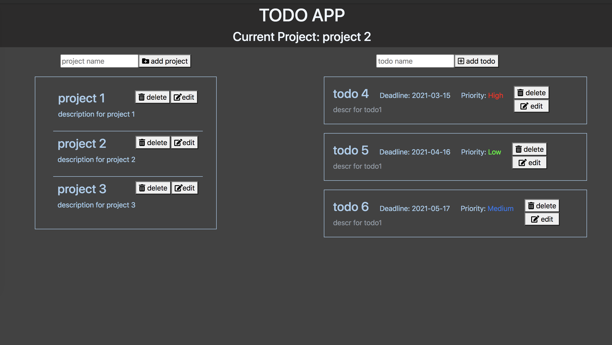

Microverse JS Project #3

## JS - TODO List Page

In the project I created a simple todo app with the by following the [requirements in Odin page](https://www.theodinproject.com/courses/javascript/lessons/todo-list).

restaurant website using JS6 and finished the following milestones:

- [x] Miltestone 1 - Setup webpack to load style files, pictures and bootstrap classes.
- [x] Miltestone 2 - Create Todo, Project and Organization objects that will be created dynamically. Expand objects with several attributes.
- [x] Milestone 3 - Add view files and logic for populating projects.
- [x] Milestone 4 - Add view files and logic for populating todos.
- [x] Milestone 5 - Add CRUD methods to save to `localStorage`, update, delete and edit objects in `localStorage` . I use factory functions to handle them.
- [x] Milestone 6 - Update UI.
- [x] Milestone 6 - Update readme file.
- [x] Milestone 6 - Update code to obey linter rules.

## Built With

- Javascript/ES6
- npm v14.13.1
- Webpack 5.11.0
  - [HtmlWebpackPlugin](https://webpack.js.org/plugins/html-webpack-plugin/)
  - [style-loader](https://webpack.js.org/loaders/style-loader/#root)
  - [css-loader](https://webpack.js.org/loaders/css-loader/#root)
  - [file-loader](https://webpack.js.org/loaders/file-loader/#root)
  - [DevServer](https://webpack.js.org/configuration/dev-server/)
- HTML5/CSS
- Github Actions
- Bootstrap v4.5

## Live Demo

[Live Demo Link](https://raminmammadzada.github.io/js-todo-list/)

## Getting Started

To get a local copy up and running follow these simple example steps.

- Clone the repository by runing `git clone git@github.com:RaminMammadzada/js-todo-list.git` on your terminal
- Go into project folder `cd js-todo-list`
- Run `npm install`
- Run `npm run build`, if you want to create built files.
  - Alternatively, run `npm run dev`, if you will work on it to improve.
- Go into `dist` folder by writing `cd dist` and open `index.html` file using your favorite browser.

## Authors

👤 **Ramin Mammadzada**

- Github: [@RaminMammadzada](https://github.com/RaminMammadzada)
- Twitter: [@RaminMammadzada](https://twitter.com/RaminMammadzada)
- Linkedin: [@RaminMammadzada](https://www.linkedin.com/in/raminmammadzada)

## 🤝 Contributing

Contributions, issues and feature requests are welcome!

Feel free to check the [issues page](issues/).

## Show your support

Give a ⭐️ if you like this project!

## Acknowledgments

- Microverse
- Odin project

## 📝 License

This project is [MIT](lic.url) licensed.
